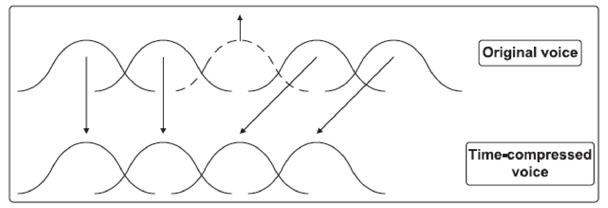

## Abstract

Voice disguise has raised people’s attention recently for been widely used in illegal applications, such as wire fraud and kidnapping which has a huge negative impact on audio authenticity. Identification of disguised voices seems extreamly important especially in some fields where audio forensics are required such as law enforcement. This study will review types of disguised voices and mainly analyzes deliberate voice disguise in detail.

_Index Terms — voice disguise, audio autenticity, audio, forensics, indetification._

## Introduction

Nowadays, our society, compared to one century ago, seems to contain more and more fake information due to highly development of technology. It is a worldwide tendency that voice disguise has been used frequently for indentities concealing. Since disguised voices has been used for threatening calls, kidnapping, even emergency police calls and human can not directly indentify the disguised voices without any tools or techniques, this article illustrates the basic concepts, implemetations and analysis in disguised voices.

<!-- | Comparision of Different Types of Disguised Voices | -->

|   Taxonomy    |        Eletronic        |     Non-electronic     |
| :-----------: | :---------------------: | :--------------------: |
|   Delibrate   |  Electronic Scrambling  |        Whisper         |
| Non-Delibrate | Limitation of Bandwidth | Speaking with Emotions |

## Types of Disguised Voices

The voice disguise can be classifed into two independent dimensions: non-electronic with electronic and deliberate with non-deliberate as shown in Table1. For deliberate non-electronic voice disguise, speakers have many ways to alter their voices by using foreign accent, pinched nostril, distortion mouth, speed rate acceleration and so on. For deliberate electronic voice disguise, some softwares such as voice changer, Audacity can be used to change voice for confusing recognition. In non-deliberate situations, disguise voice is mainly generated by external factors. Illness or emotional feelings may cause nonelectronic voice disguise and voice channels with noise or bandwidth limitations generate electronic voice disguise.

## Non-Electronic Voice Disguise

Due to electronic deliberate voice disguise is relatively uncommon, it rarely can be seen in voice disguise situations. Non-deliberate voice disguise is a poorly researched area expect for some special researchers such as medical personnel for non-deliberate non-electronic voice disguise or electrician for non-deliberate electronic voice disguise. So, non-electronic deliberate voice disguise is focused in this part and the first step: data collection of this kind of disguised voices is necessary for implementation.

### Data Collection

According to Rodman and Powell(2000), there are not any standardized databases of voice disguises. Collection of voice data and integrating them into database is the begining of study of voice disguise. The data collection should follow the specifications and standards which were formated by Boves and Carlo with their teammates in 1994. The recomendation requirement is: 1. Voice source is from 30 to 40 speakers with multiple
sessions. 2. The recordings should be digital, sampled by high quality recording devices at 22kHz, 16 bit quantization in a low noise environment. 3. Data should be permanently stored in superior media for future use.

### Identification Application Areas

1. Law Enforcement: It is important for law enforcement agencies to make sure the audio autenticity when matching voice of a suspect with different recorded voices. Voice disguise identification is applied to avoid suspects using methods deliberately change their voices for getting rid of crimes.

2. Speaker Verification: Speaker recognition of intentional disguised voices is widely used in the forensic field, however, it is also necessary to establish methodologies for research into unintentional disguised voice speaker recognition. When someone has illness problem casuing non-deliberate voice disguise, the speaker verifivation for access to sites may be a problem. So the speaker verification system should be trained with a large number of different disguised voices to tell the difference between deliberate and non-deliberate disguised voices.

### Identification Implementation

Forensic Automatic Speaker Recognition System

According to Zhang and Tan’s implementation of non electronic delibrate voice disguise identification, Forensic Automatic Speaker Recognition System(FASRS) developed by the department of computer science in Tsinghua University is used. It can both identify and verify speakers with a database collecting more than 2000 speakers’ voices in different channels and automatic speaker recognition which is independent of speech text and language making it better than traditional spectrogram comparison.

Method

Forensic Automatic Speaker Recognition System can indentify voice disguise automatically and output the disguise rate by two input voices which are normal voices and disguise voices with a threshold. The system compares each testing voice with all voices in
database to determine if the voice is disguised.

Input:

- Sample A: Normal voices modeling known speakers.

- Sample B: Disguised voices modeling unknown speakers.

- The setting threshold for similarity comparision.

Output:

- Score of similarity rate.

- The result of verification according to the obtained
  score.

Experimental Results Summary

Speaker recognition by normal voice: The system performs well for normal voices recognition which shows it can correctly recognize almost all input voices of speakers. From the similarity between one speaker’s two differents ways of speaking, it displays intra-speaker variation differs among speakers.

Speaker recognition by disguised voices: The speaker recognition performs badly because the
voice has been disguised. Except for foreign accent disguising, disguised voice recognition rates are significantly decreased. According to different disguising types, the effects of diaguising are different. One of types, which is pinched nostril, has a great effect because of large changes of vocal tract configuration and voice quality.

Inter-speaker variation on disguising skill: Both for normal voices and disguised voices, speaker recognition has inter-speaker variation. Different speakers have different disguise skills. If a speaker is good at disguising his/her voice, the disguised voices then change a lot and the results show lower speaker recognition rate and correct recognition rate.

## Electronic Voice Disguise

Above reviews are mainly based on non-electronic voice disguise because electronic voice disguise is very uncommon. However, in some television and radio interviews, voices are often disguised electronically for privacy protection.

There are few researches related to electronic disguised voices but Wu and Huang(2014) found an algorithm for electronic disguised voices identification according to two frequency spectral properties which are modification of the frequency spectrum of speech signals, and mel-frequency cepstrum coefficients (MFCCs). They extracted MFCC statistical moments including mean values and correlation coefficients as acoustic features and then separate disguised voices from original signals. Their algorithm is remarkable which can detect more than 90% voices from various databases and disguised by different methods.

### General Model

We can analyze eletronic voice disguise in waveforms detailly since the essence of voice disguise is to modify the pitch of a speaker. For a voice in time-domain, we can use resampling to stretch or compress the waveform to change the pitch in order to disguise this voice. And for performing voice sampling, interpolation and decimation can be applied in multirate signal processing. Eletronic voice disguise can generated by a simple model.

For a short-time speech signal x(n), we denote:

• The duration: D

• Frequency spectrum: X(ω)

• The pitch: P

For the resulting signal resampled by a factor of 1/α, we denote:

• The duration: D0

• Frequency spectrum: X(ω)'

• The pitch: P'

Now we have:

D0 = D/α (1)

X'(ω) = 1/(α) · X(ω/α), |ω| ≤ min(π, απ) (2)

P' = αP (3)

If α<1, the orignal signal is stretched in time-domain, P decreases and X(ω) is compressed in frequency-domain. If α>1, the orignal signal is compressed in time-domain, P raises and X(ω) is stretched in frequency-domain. As we can see, D and P are changed simultaneously to D’ and P’ by resampling. It causes alteration is not steady, so we need time-scale modification to modify D’ back to D.

### Time Scale Modification

Time scale modification plays a significent role in data compresssion, speech synthsis and other related fields. Roucos and Wilgus first proposed the Synchronized Over-Lap and Add (SOLA) algorithm in 1985 which is the main approach for time-scale modification.

In SOLA, an original voice signal is firstly decomposed into successive short frames. For obtaining time stretching or compressing, some frames are changed like repeating or discarding while some of frames are remained and it is straightforward to show in plots. As illustrated in Fig.1, the 3rd frame of the original voice is repeated for voice stretching and the 3rd frame of the original signal in Fig.2 is discarded for voice compressing.

Fig. 1: Time stretching in the SOLA algorithm.

Fig. 2: Time compressing in the SOLA algorithm.

During time-scale modification, we use the factor α to modify the duration from D' to D and the duration is changed without affecting X(ω)' and P. As two equations shown below, the resampling factor 1/α is used to disguise the signal from x(n) to x'(n).

• D'' = αD' = D (4)

• P'' = P' = α · P (5)

For disguising factor α, P decreases if 0 < α < 1 and P increases if α > 1.

### Phonetics

We use 12 semitones division to represent voice pitch in phonetics which means the pitch of a voice can raise or decrease at maximum 11 semitones. We can also use a factor to determine measurement of voice pitch by semitones to illustrate which level the disguised voice is as shown in below:

• α = 2K/12, K = ±1, ±2, ±3, ±4... ± 11

• P'' = 2K/12 · P, K = ±1, ±2, ±3, ±4... ± 11

For disguising factor K semitones, P decreases if K is negative and P increases if K increases which is similar to above discussions.

### Indentification Algorithm

Extraction of Acoustic Features:

MFCC is a good model for speech signals in recognition and we can extract parameters from traditional MFCC. Generally, there are five steps for acoustic features extraction:

Step 1: Signal segmentation. Firstly, we seperate the orignal signal into N frames with the duration between 10 and 30 ms to guarantee each frame is stationary.

Step 2: Apply a hamming window to each frame to obtain windowed frames.

Step 3: Use fourier transform to calculate the frequency spectrum.

Step 4: Use M triangular band-pass filter to create a Mel-filter and use it to get the power spectrum.

Step 5: Use the Discrete Cosine Transform (DCT) to calculate the L-dimensional MFCC.

Indentification System:

The identification algorithm is based on MFCC statistical moments and SVM classifiers. The general voice disguise identification system consists of a training stage and a testing stage as shown in Fig.3.

Fig. 3: General identification system of disguised voices.

In the training stage, firstly we have orignal voice set and disguised voice set with N different semitones. Then we extract training features of each through training to N SVM classifiers for testing to determine the disguise result for each classifier.

In the testing stage, we extract acoustic features from testing voice and let these features go into SVM classifiers to test if the signal is disguised or not. And for the
testing results, to determine the result is a orignal voice, it should make sure all N results are orignal otherwise it is disguise once any one of N is disguised.

## Conclution

This artcile analyzes voice disguise in two different types which are electronic voice disguise and nonelectronic voice disguise. The content focuses on deliberate voice disguise which is a rich research area related to our daily life. For the implemation of non-electronic deliberate voice disguise, Forensic Automatic Speaker Recognition System has been used and implementation details are covered. It also illustrates the general model
and idea of identification of electronic deliberate voice disguise. In summary, it shows a general overview of voice disguise and forms a framwork for further research.
