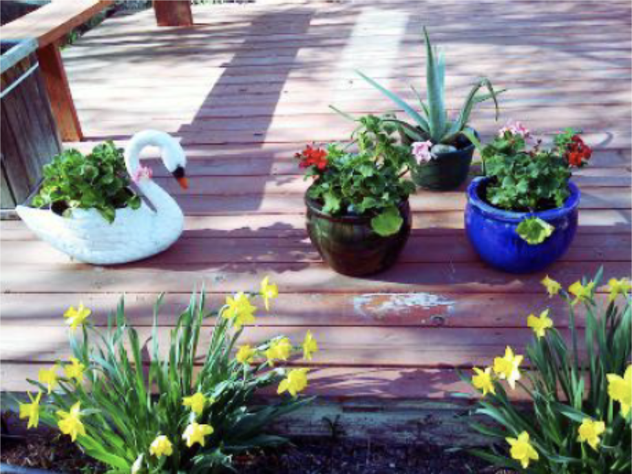
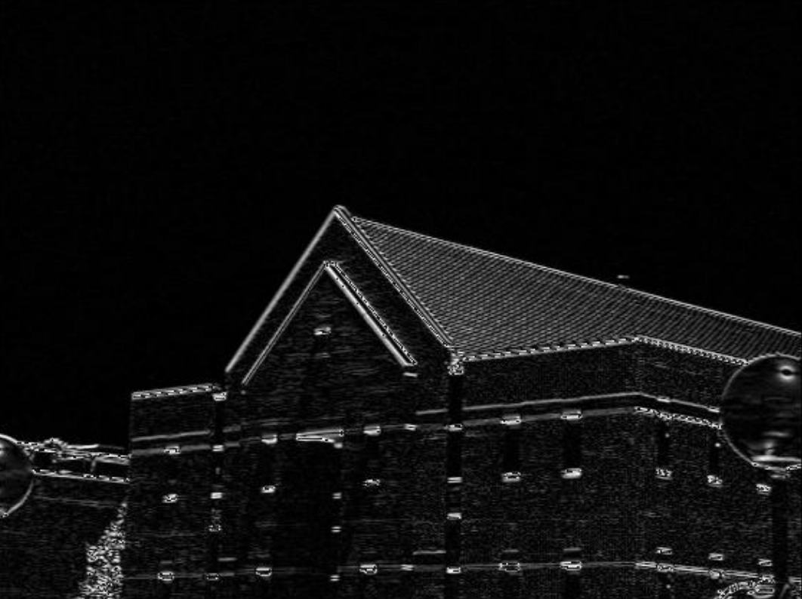

## Histogram Equalization

The original image:


The modified color image after applying the histogram equalization algorithm to R, G, and B channels separately



Java Solution:

```java
import java.io.*;
public class P1 {
    public static void main(String args[]) throws IOException {
        FileInputStream in = null;
        FileOutputStream out = null;
        try { in = new
            FileInputStream("C:/Users/CHAO/Desktop/summer_deck2.raw");
            out = new
            FileOutputStream("C:/Users/CHAO/Desktop/summer_deck2+.raw");
            int i, j, k;
            int[][][] image_in = new int[3][400][300];
            for (k = 0; k < 3; k++)
                for (i = 0; i < 400; i++)
                    for (j = 0; j < 300; j++)
                        image_in[k][i][j] = in .read(); // Read the input image into
            // image_in[][][]
            int[][][] image_out = new int[3][400][300]; // 3 is three channels for red, green and blue
            int[] h = new int[256];
            int[] H = new int[256];
            for (k = 0; k < 3; k++) {
                for (i = 0; i < 256; i++) // initialization of h[]
                    h[i] = 0;
                for (i = 0; i < 400; i++)
                    for (j = 0; j < 300; j++)
                        h[image_in[k][i][j]]++;
                H[0] = h[0];
                for (i = 1; i < 256; i++) // Compute the cumulative histogram and
                    // store it in H[]
                    H[i] = H[i - 1] + h[i];
                double s = 0.002125; // get the scaling factor S
                // 0.00213 is k-1/m*n which is 255(8 bits grayscale per
                channel) / 400 * 300
            for (i = 0; i < 256; i++) // Normalize H[] with the scaling factor S
                H[i] *= s;
            for (i = 0; i < 400; i++)
                for (j = 0; j < 300; j++) // get the image_out[] from the H[]
                    image_out[k][i][j] = H[image_in[k][i][j]];
        }
        for (k = 0; k < 3; k++)
            for (i = 0; i < 400; i++)
                for (j = 0; j < 300; j++)
                    out.write(image_out[k][i][j]);
    } finally {
        if ( in != null) { in .close();
        }
        if (out != null) {
            out.close();
        }
    }
}
}

```

Transfer the original image from GRB model to HSV model. Applying the histogram equalization to v which is the value in HSV. Transfer the processed HSV color image back to GRB model.


Java Solution

```java
import java.io.*;
public class P2 {
    public static void main(String args[]) throws IOException {
        FileInputStream in = null;
        FileOutputStream out = null;
        try { in = new
            FileInputStream("C:/Users/CHAO/Desktop/summer_deck2.raw");
            out = new
            FileOutputStream("C:/Users/CHAO/Desktop/summer_deck2++.raw");
            int i, j, k;
            int[][][] image_in = new int[3][400][300];
            for (k = 0; k < 3; k++)
                for (i = 0; i < 400; i++)
                    for (j = 0; j < 300; j++)
                        image_in[k][i][j] = in .read();
            int[][][] image_out = new int[3][400][300];
            channels
            for red, green and blue
            double[][][] hsv = new double[3][400][300];
            // RGB to HSV
            int r, g, b;
            double rr, gg, bb;
            double h = 0, s, v;
            double min, max, delta;
            for (i = 0; i < 400; i++)
                for (j = 0; j < 300; j++) {
                    // do the calculation according to the mathematical formula
                    r = image_in[0][i][j];
                    g = image_in[1][i][j];
                    b = image_in[2][i][j];
                    rr = r / 255.0;
                    gg = g / 255.0;
                    bb = b / 255.0;
                    min = Math.min(Math.min(rr, gg), bb);
                    max = Math.max(Math.max(rr, gg), bb);
                    delta = max - min;
                    // get V
                    v = max;
                    // get S
                    if (max != 0)
                        s = delta / max;
                    else {
                        s = 0;
                        h = -1;
                    }
                    // get H
                    if (rr == max)
                        h = (gg - bb) / delta;
                    if (gg == max)
                        h = 2 + (bb - rr) / delta;
                    if (bb == max)
                        h = 4 + (rr - gg) / delta;
                    h *= 60;
                    if (h < 0)
                        h += 360;
                    hsv[0][i][j] = h;
                    hsv[1][i][j] = s;
                    hsv[2][i][j] = v;
                }
            // histogram equalization of values (v)
            int[] hh = new int[256];
            int[] H = new int[256];
            int vvv;
            // initialization of h[]
            for (i = 0; i < 256; i++)
                hh[i] = 0;
            // Compute the histogram of values and store it in h[]
            for (i = 0; i < 400; i++)
                for (j = 0; j < 300; j++) {
                    vvv = (int)(hsv[2][i][j] * 255.0);
                    hh[vvv] += 1;
                }
            // Compute the cumulative histogram and store it in H[]
            H[0] = hh[0];
            for (i = 1; i < 256; i++)
                H[i] = H[i - 1] + hh[i];
            // get the scaling factor S 0.002 is k-1/m*n which is
            255 / 400 * 300
            double ss = 0.002;
            // Normalize H[] with the scaling factor S
            for (i = 0; i < 256; i++)
                H[i] *= ss;
            // get the processed values array from the H[]
            for (i = 0; i < 400; i++)
                for (j = 0; j < 300; j++) {
                    vvv = (int)(hsv[2][i][j] * 255.0);
                    hsv[2][i][j] = H[vvv] / 255.0;
                }
            // HSV to RGB
            rr = 0;
            gg = 0;
            bb = 0;
            for (i = 0; i < 400; i++)
                for (j = 0; j < 300; j++) {
                    h = hsv[0][i][j];
                    s = hsv[1][i][j];
                    v = hsv[2][i][j];
                    double c, x, m;
                    // do the calculation according to the
                    mathematical formula
                    c = (v * s);
                    x = c * (1 - Math.abs((h / 60) % 2 - 1));
                    m = v - c;
                    if (h >= 0 && h < 60) {
                        rr = c;
                        gg = x;
                        bb = 0;
                    }
                    if (h >= 60 && h < 120) {
                        rr = x;
                        gg = c;
                        bb = 0;
                    }
                    if (h >= 120 && h < 180) {
                        rr = 0;
                        gg = c;
                        bb = x;
                    }
                    if (h >= 180 && h < 240) {
                        rr = 0;
                        gg = x;
                        bb = c;
                    }
                    if (h >= 240 && h < 300) {
                        rr = x;
                        gg = 0;
                        bb = c;
                    }
                    if (h >= 300 && h < 360) {
                        rr = c;
                        gg = 0;
                        bb = x;
                    }
                    r = (int)((rr + m) * 255.0);
                    g = (int)((gg + m) * 255.0);
                    b = (int)((bb + m) * 255.0);
                    image_out[0][i][j] = r;
                    image_out[1][i][j] = g;
                    image_out[2][i][j] = b;
                }
            // Write the result image_out[][]
            for (k = 0; k < 3; k++)
                for (i = 0; i < 400; i++)
                    for (j = 0; j < 300; j++)
                        out.write(image_out[k][i][j]);
        } finally {
            if ( in != null) { in .close();
            }
            if (out != null) {
                out.close();
            }
        }
    }
}
```

## Pseudo Color

The original image:


The processed image by applying the pseudo color:


Java Solution

```java
import java.io.*;
public class P3 {
    public static void main(String args[]) throws IOException {
        FileInputStream in = null;
        FileOutputStream out = null;
        try { in = new FileInputStream("C:/Users/CHAO/Desktop/tempusa.raw");
            out = new
            FileOutputStream("C:/Users/CHAO/Desktop/tempusa+.raw");
            int i, j, k;
            int[][] image_in = new int[640][420];
            for (i = 0; i < 640; i++)
                for (j = 0; j < 420; j++)
                    image_in[i][j] = in .read(); // Read the input image into
            image_in[][]
            int[][][] image_out = new int[3][640][420]; // 3 is three channels for red, green and blue
            int[][] table = new int[256][3]; // generate a pseudo color look-up table
            with 256 entries
            for (i = 0; i < 256; i++) // the initialization of the pseudo color look-up
                table
            for (j = 0; j < 3; j++)
                table[i][j] = 0;
            table[0][0] = 255; // set red
            table[85][1] = 255; // set green
            table[170][2] = 255; // set blue
            // the pseudo color look-up table is a loop from red to green to blue and
            back
            // to blue
            // for the grayscale is from 0 to 255, I set the step is 3 in this pseudo
            color
                // table
                // from [255][0][0] , [252][3][0] , [249][6][0] ... to [0][255][0] and from
                // [0][255][0] , [0][249][3] , [0][246][6] to [0][0][255] and then back to
                // [255][0][0]
                // generate the color spectrum from red to green which is from
                [255][0][0] to
            // [0][255][0]
            for (i = 1; i <= 84; i++) {
                table[i][0] = table[i - 1][0] - 3;
                table[i][1] = table[i - 1][1] + 3;
            }
            // generate the color spectrum from green to blue which is from
            [0][255][0] to
            // [0][0][255]
            for (i = 86; i <= 169; i++) {
                table[i][1] = table[i - 1][1] - 3;
                table[i][2] = table[i - 1][2] + 3;
            }
            // generate the color spectrum from blue back to red which is from
            [0][0][255]
            // to [255][0][0]
            for (i = 171; i <= 255; i++) {
                table[i][0] = table[i - 1][0] + 3;
                table[i][2] = table[i - 1][2] - 3;
            }
            // switch the grayscale image to the pseudo color image
            for (k = 0; k < 3; k++)
                for (i = 0; i < 640; i++)
                    for (j = 0; j < 420; j++)
                        image_out[k][i][j] = table[image_in[i][j]][k];
            // Write the result image image_out[][]
            for (k = 0; k < 3; k++)
                for (i = 0; i < 640; i++)
                    for (j = 0; j < 420; j++)
                        out.write(image_out[k][i][j]);
        } finally {
            if ( in != null) { in .close();
            }
            if (out != null) {
                out.close();
            }
        }
    }
}
```

## Pixel Operators

horizontal edge image:



vertical edge image:


gradient image:


thresholded gradient image using a threshold of TE = 128:


Java Solution

```java
import java.io.*;
public class P1 {
    public static void main(String args[]) throws IOException {
        FileInputStream in = null;
        FileOutputStream out = null;
        try { in = new FileInputStream("C:/Users/CHAO/Desktop/building.raw"); // file
            path to read
            out = new FileOutputStream("C:/Users/CHAO/Desktop/building+.raw"); //
            file path to write
            int i = 0, j = 0;
            int[][] image_in = new int[420][560];
            int[][] image_out_x = new int[420][560]; // compute the horizontal edge
            image
            int[][] image_out_y = new int[420][560]; // compute the vertical edge
            image
            int[][] image_out_g = new int[420][560]; // compute the gradient image
            int[][] image_out_g_t = new int[420][560]; // compute the thresholded
            gradient image
            for (i = 0; i < 420; i++) // here is to read the binary data into
                // array image[][]
                for (j = 0; j < 560; j++)
                    image_in[i][j] = in .read();
            int x, y; // x is horizontal edge, y is vertical edge
            double g; // g is gradient
            for (i = 1; i < 419; i++)
                for (j = 1; j < 559; j++) {
                    x = image_in[i + 1][j + 1] - image_in[i - 1][j + 1] + 2 * image_in[i +
                            1][j] -
                        2 * image_in[i - 1][j] + image_in[i + 1][j - 1] -
                        image_in[i - 1][j - 1];
                    // compute x according the Hpx in Sobel Operators
                    y = image_in[i - 1][j - 1] - image_in[i - 1][j + 1] + 2 * image_in[i][j - 1] -
                        2 * image_in[i][j + 1] + image_in[i + 1][j - 1] -
                        image_in[i + 1][j + 1];
                    // compute y according the Hpy in Sobel Operators
                    x = Math.abs(x);
                    image_out_x[i][j] = x; // put calculated x into the output array
                    y = Math.abs(y);
                    image_out_y[i][j] = y; // put calculated y into the output array
                    g = Math.sqrt(x * x + y * y);
                    g = Math.abs(g);
                    image_out_g[i][j] = (int) g; // put calculated g into the output array
                    if (g > 128)
                        image_out_g_t[i][j] = 0; // calculated g with a threshold of Te =
                    128 and put it into the output
                    // array
                    else
                        image_out_g_t[i][j] = 255;
                }
            for (i = 0; i < 420; i++) // write out the processed array into the image for
                for (j = 0; j < 560; j++) // this one is for the thresholded gradient image
                    out.write(image_out_g_t[i][j]);
            // because it only contains one output stream, so we should write out the
            image(horizontal edge image, vertical edge image, gradient image, thresholded gradient image) one by one
        } finally {
            if ( in != null) { in .close();
            }
            if (out != null) {
                out.close();
            }
        }
    }
}
```

w=1


w=2


w=3


w=4


w=5


Java Solution

```java
import java.io.*;
public class P2 {
    public static void main(String args[]) throws IOException {
        FileInputStream in = null;
        FileOutputStream out = null;
        try { in = new FileInputStream("C:/Users/CHAO/Desktop/moon.raw"); // file
            path to read
            out = new FileOutputStream("C:/Users/CHAO/Desktop/moon+.raw"); // file
            path to write
            int i = 0, j = 0;
            int[][] image_in = new int[528][464];
            int[][] image_out = new int[528][464];
            for (i = 0; i < 528; i++) // here is to read the binary data into
                // array image[][]
                for (j = 0; j < 464; j++)
                    image_in[i][j] = in .read();
            int w = 1; // w is the coefficient and can be changed to different value for
            the test
            int s;
            int[][] mask = new int[][] {
                {0, 1, 0},
                {1, -4, 1},
                {0, 1, 0}
            }; // mask is
            the Laplacian sharpening
            // filter
            for (i = 1; i < 527; i++)
                for (j = 1; j < 463; j++) {
                    s = 0; // s is the sum of the filter
                    for (int a = -1; a < 2; a++)
                        for (int b = -1; b < 2; b++) {
                            s += image_in[i + a][j + b] * mask[1 + a][1 + b]; // filter
                            the pixel with filter
                        }
                    s = image_in[i][j] - w * s; // calculate the new value according to
                    the
                    function in the book in
                        // image sharping with laplacian
                        sharping filter
                    image_out[i][j] = Math.abs(s); // s should be the absolute value
                    before be writen into output array
                }
            for (i = 0; i < 528; i++)
                for (j = 0; j < 464; j++)
                    out.write(image_out[i][j]);
        } finally {
            if ( in != null) { in .close();
            }
            if (out != null) {
                out.close();
            }
        }
    }
}
```
