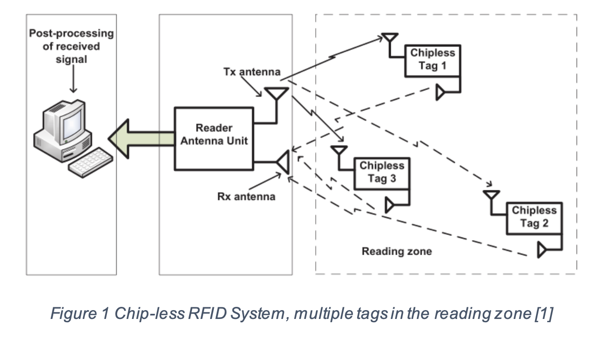
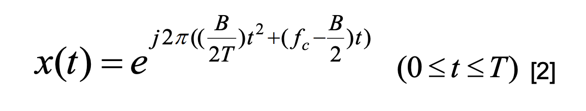
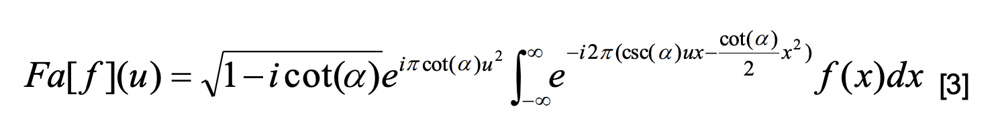
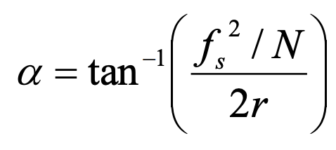
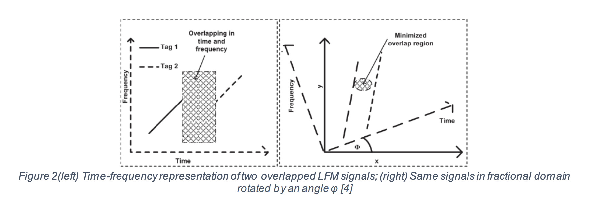
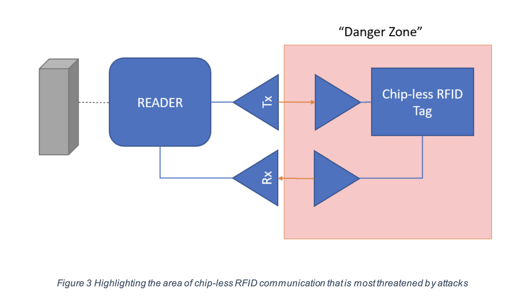

## Abstract

For the chip-less RFID tags which are lower cost and more convenient than normal chip tags. In this paper we give a solution for collision detection using chip-less RFID in this paper, as well as tightening chip-less RFID security. Linear Frequency Modulated (LFM) is used as sent signal and the received signal is the summation of these LFM signal. Using a digital signal filtering system based on Fractional Fourier Transform (FrFT) to separate these overlapping signal and getting signal which is ready for decoding. At last, IDs of different chip-less tags are got and identified by users. It is a great solution to daily application because using chip-less tags in RFID both brings convenience to us and saves the cost compared to normal RFID system and it is easy to largely manufacture and can replace chip tags in the future.

In addition to this, the usage of Unmanned Aerial Vehicles (UAVs) for establishing and maintaining a secure network between the vehicles and the servers, as well as the UAVs themselves and their control stations. Security vulnerabilities of UAVs are discussed, as well as solutions for tightening security surrounding them, before proposing a solution.

_Keywords: RFID, chip-less tags, LFM, FrFt, UAV, Encryption, Security_

## Introduction

### RFID Components and Collision

Components of normal RFID systems: A traditional RFID system includes three parts: RFID tags, a reader and an unit used to process the data. For the reason that the integrated circuits of RFID tags are too expensive, it prevents RFID to be a widely used method for application nowadays.

Introduction to chip-less RFID system: For better using RFID in wireless identification system to reduce the cost and both improve the efficiency, there we consider a chipless RFID system and put this system into collision avoidance application.

The system we designed includes two antennas. One is for receiving the signal and one is for transmitting the signal. The received signal should be the interrogation and the transmitted signal should be the signal after modulated. We will process the signal received from the chip-less tag in the reader and extract tag ID from the frequency spectrum and then decode it.

In application, for example many cars are on the road at the same time, multiple chipless tags may be close to each other just like the graph shown below.

RX(reader) interprets all interrogation signal tags. For chips including tags, they may have some components to turn off response but for the chip-less tags it is unfortunately that they will mess up because all chip-less tags respond simultaneously. Once collision happens, they all response their own ID by attenuating the interrogation signal. For the received signal, it may be all the collision signals from all tags.

The basic idea for solution to chip-less RFID is to detect the positions of multiple chip-less tags and decode their identifications in different situations. For chip-less RFID, it is very hard to match each other because it does not have any controlling component. Therefore, our main task is to separate signal from multiple chip-less tags.

The usage of Chip-less RFID tags and UAV technologies each have their own security vulnerabilities and potential problems that can arise from a high saturation in the market without necessarily knowing much about the security risks. Because of this, we will be presenting the current security challenges faced by RFID and UAV systems, followed by existing proposed solutions to these challenges.

## Theoretical Background of the Solution

### Linear Frequency Modulation (LFM) Signal

An LFM signal is defined as:

In other situations, x(t) is equal to 0.

B for total bandwidth, fc for center frequency and T for duration of the signal. For
interrogation signal, the chirp rate is calculated by r=B/T.

C In chirp separation, we used to use Short Time Fourier Transform (STFT) or other techniques. Although it is efficient but not useful for overlapping signal. We think Fractional Fourier Transform (FrFT) is better for analyzing the connection between time domain and frequency domain. It does not just transmit signal from time domain to frequency domain just like common Fourier Transform does, FrFT transmits signal from time domain into an intermediate domain between time and frequency so it can get a minimum overlap between the chirps. The graph below shows the difference.

### Fractional Fourier Transform

For any real α, the α-angle fractional Fourier transform of a function ƒ is denoted
by Fα(u) and defined by:

The most important part is that FrFT has a rotation angle. Then we can use this
formula to calculate the angle α.

fs for sampling frequency, N for numbers of data points and r
for chirp rate. We also can use rotation angle to calculate the order of transform α which
is α=2\*φ /3.14.

### Current Threats to RFID

The current threats to RFID technology primarily include (but are not necessarily limited to): Jamming, a "deliberate attempt to disturb the air interface between reader and tag". Jamming can be done passively through shielding or actively through the use of transmitter. In both cases the goal is to hinder or prevent the communication between the tag and the reader. Another, and arguably the highest risk, attack is eavesdropping.

"Eavesdropping occurs when an attacker intercepts data with a compliant reader—one for the correct tag family and frequency—while a tag is being read by an authorized RFID reader". Eavesdropping ties into other attack methods such as replay attacks, spoofing, and cloning. Replay attacks are based around an attacker recording the information that is exchanged between the reader and the tag, and then plays it back to the reader to imitate the recorded tag. In the cases of a spoofing attack, the attacker would send out the signal that a reader would send to a tag, or vice versa in order to trick the reader, or obtain information on the RFID tag that it would otherwise only give to an authorized reader.

In addition to the above, another large security risk with RFID technology is RFID
Cloning. A RFID cloning attack produces genuine tags" replicas, which are usually
called clone tags. These clone tags are effectively identical to the genuine RFID
tags as far as the reader is concerned. Cloning attacks generally don’t involve
eavesdropping, as the original tag would essentially just be copied and thus would
respond theoretically the exact same way as the genuine tag when communicating with
the reader.

The “Danger Zone” is the primary area where high risk attacks would take place. Therefore, the goal is to limit this danger by building a security and authorization system into the reader.

### Current Threats to UAVs

Some of the common current threats to UAVs or “drones” are Eavesdropping, which similarly to RFID eavesdropping above, however “due to the lack of encryption and other protective mechanisms, the exchanged UAV information in the open environment can be directly accessed by the adversary”. Due to a lack of secure authentication schemes, “an adversary can masquerade as a legitimate entity to inject false information or commands”. These Information Injection attacks can lead to more dangers such as spoofing GPS data, causing the UAV to think it is in a different location than it actually is, forcing it to land or potentially collide with the environment. There is also the potential for denial of service or DOS attacks, much like RFID
Jamming attacks where the UAV’s communication is cut off by an overwhelming flood of junk data.

## Proposed Solutions

### Anti-collision Solutions

Generally, there are three steps in this processing system. First step is to calculate the order of α from fs and N and then transform the received signal to fractional domain of order α. Second step is to estimate the number of peaks which corresponds to number of tags and then build a signal filtering system to separate the signals to get the target signal. The target signal can be got through magnitude plot which are peak values. The last step is to restore separated signals in time domain by transforming of order -α then we can decode tag IDs according to these separated signals’ frequency spectrum.

The most significant step is to separate the re-transmitted signal with other a great
number of signal in multiple chip-less RFID tag system. The received signal consists of
the total amount of multiple chirps which have same chirp rate as interrogation signal.
Due to the reason that different tags are in different locations, it causes a delay from the
antenna to the chirps.

There are some details about the solutions in three subsections:

1. Transformation to fractional domain

We can use the equation above to calculate the order of transformation α. Then
we use the Fractional Fourier Transform to transform the received signal to the the
fractional domain of order α. This process compresses the signal in the fractional
domain and shows spikes in magnitude graph. These spikes are corresponding to the
LFM signals shown in the received signal. And also these LFM signals are connected
with tags which re-transmit the signal. The spike is signal component without noise and
any other overlapped elements from other sources

2. Separating the signals

Once we find these spikes shown in the transformed signal, we can use the
number of these spikes to determine the number of tags present in the reading area.
Then in the fractional domain, we build the filter to select non-overlapping tags. This
part is also considered to be a significant part because how to design a good filter is
important to efficiency in separating signals.

3. Decoding the tag IDs

After separating the signals, we filter overlapping signals. For the remaining
signal, we now can use FFT(Fourier Transform) to get the frequency spectrum and then
decode these tags IDs

### RFID Security Solutions

The issue of potential RFID cloning has a number of possible solutions including
both software-based ones that involve loading secret information to tags, and Hardware
based, focusing on unique manufacturing features of tags. The best solution for our
purposes seems to be Physically Unclonable Functions or PUFs. Tags are fingerprinted
through the use of embedded functions in microchips using wire delays and gate delays
in manufactured circuits. These features are unique across chips and difficult to clone.
Combining this with shared keys and the tag ID will allow a reasonably high level of
security for our purposes.

UAV security threats are primarily in the traffic between the ground controller and
the UAV itself. The best method may be properly encrypting the communication
between the controller and the UAV using such things as WPA2 encryption with key
lengths of a reasonable length to prevent brute force based attacks, and a password
containing a mixture of upper case, lower case, and special, characters.

The ideal cheap and effective way to prevent tag impersonation, while also
combatting denial of service and supporting tag/reader anonymity is through the usage
of an algorithm located within the reader that uses the XOR operator as a hash function

### UAV Security Solutions

Ensuring the security of UAVs requires two separate isolated systems, in addition
to as much on-board autonomy as is possible

The orange box represents the overall UAV system. The only thing that directly
interacts with the physical actions that the UAV takes is the onboard programming that
is not modifiable without physical access and has limited input and output functionality.
This limited output would be reporting of potential damage or low battery messages,
and/or a “heading back to control station” message. The control station itself will have
all of its input heavily sanitized though a separate system that once again cannot modify
the onboard programming. The communication between this component and the
onboard programming will be physical only and very limited. Additionally, there will be
an isolated repeater physically attached to the UAV in some way that allows for vehicles
to communicate with their host servers.

All of the traffic between the repeater and vehicle will be encrypted via WPA2
encryption and merely passing it along to another repeater or the server’s network itself.
The communication between control and the UAV will be restricted by MAC address,
not broadcasting an SSID and encrypted via WPA2.

## Conclusion and Future Work

n this proposed solution, we mainly solve the significant problem which is how to
separate overlapping signals when using chip-less RFID. As we known, using RFID to
detect collision is very popular and the technology is widely used in many luxury cars.
For the low cost, we create this chip-less RFID algorithm to let even common cars have
this technique to make better safety.

In future work, I have an adventure thinking which is creating a better system to
transform the signal from time domain to frequency domain and transform from
frequency domain back to time domain at the same time in FrFT. It should separate the
signal into different parts and process the transformation synchronously. What I plan to
do is to create a ''buffer domain'' separately from time domain, frequency domain and
transformation domain. It is used as a springboard for transformation to increase the
speed. The main problem for this adventure thinking is all of mentioned domains are
changing all the time during transformation so what we should do is to find the best time
to let the “buffer domain” work and then do the simultaneous transformation. It can save
transformation time a lot especially in long distance communication and is a perfect
solution for satellitetes communication

The implementation of UAVs with customized isolated systems as mentioned
should result in drastically more secure UAVs than are currently available. However;
this will take extensive research and development to both creation this system
physically and logically in order to properly sanitize the input and create a “smart”
enough UAV that it can operate mostly autonomously. The usage of such encryption
14 schemes however should be immediately implementable, it’s merely a matter of
ensuring people using UAVs know to secure the communication with proper encryption
and strong passwords.

The implementation of chip-less RFID tags allows for lower costs, as does
utilizing the simple XOR hash function mentioned earlier in this paper. The simplicity of
this hash function will allow for adequate security while also preventing denial over
service as it can process the data very quickly with low effort and cost, which also keeps
costs overall low. Basing the Tag ID on the physical properties will further ensure
difficulty in cloning or exploiting this system. Basic testing would be required to see just
how well it actually stands up to denial of service attacks as well as more brute forced
based attacks (such as ones using rainbow tables). Though added length and
complexity can aid in this, as can a pseudo random number generator that is as close to
true random as is possible and has no known exploits/flaws.
