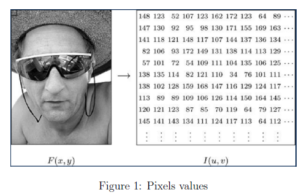
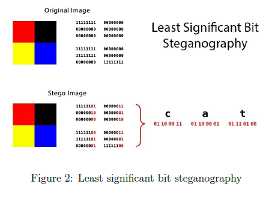
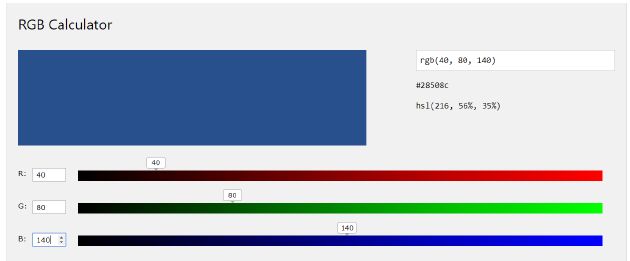
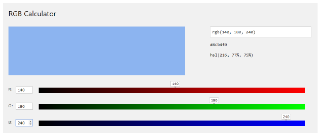
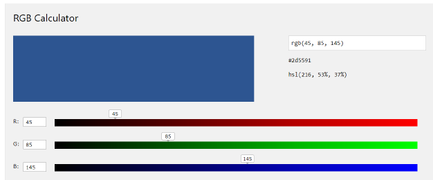
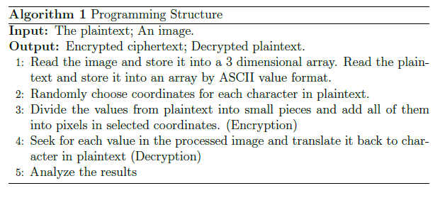
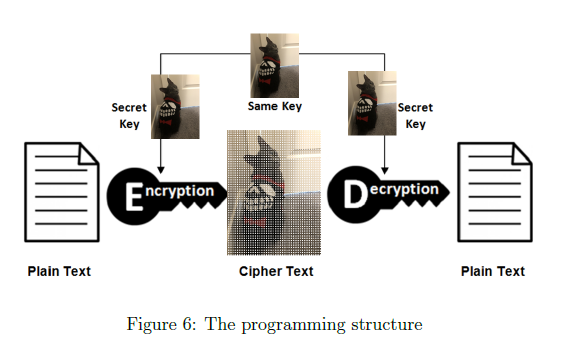
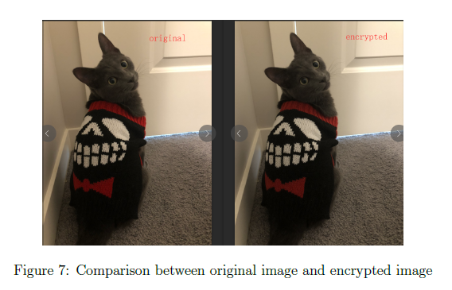
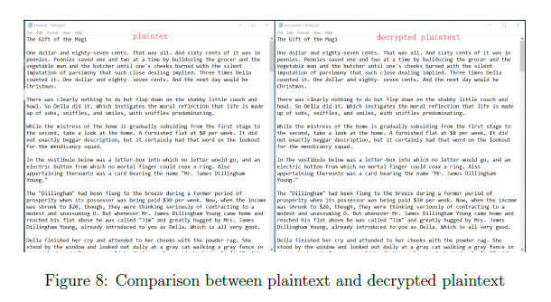

## Abstract

Computer crimes such as computer virus, networking intrusion, networking cheating, face recognition disguise have been raised recently, computer forensics play an extremely significant role in striking these illegal activities. The main purpose of computer forensics is to provide the court with traces of criminals in computers as valid evidences to bring these suspects to the justice.

Among these computer forensics, we select images forensics for detail researching as well as image processing and steganography. Image processing can detect fraud images by analyzing pixel values and steganography can hide information in pictures and make them into different fragments for security.

The structure of the whole project will be four main parts: concept of computer forensics, image processing, steganography and implementation. Image processing and steganography we plan to research are all related to the security. At last, we use the practical implementation to consolidate learned concepts.

Our plan is firstly doing some surveys to generally know basic concepts of computer forensics, image processing and steganography. Secondly, we select some papers to compare their main contents, extract useful parts to analyze and write our new ideas. Last, we modify our own creative ideas and implement our innovative methods in image processing and steganography.

## Introduction

In this project, based on computer security, we mainly discuss three parts: computer forensics, image processing and steganography. For all of three parts, basic concepts and key points have been illustrated. In addition, we generate some new ideas and have done a practical implementation based on steganography.

## Computer Forensics

### Introduction to computer forensics

Nowadays many computers are used to perpetrate crimes as attacking tools for criminal activities. Computers have evolved from large complicated machines to much less complicated smart devices that can perform a range of activities. A computer is a device used to solve problems, store and retrieve information, process data and do various things.

Forensics involve methods and techniques used in investigating and solving crimes. Most criminals unknowingly leave traces of evidence at crime scenes. Forensics deal with collecting this evidence and performing the necessary in- vestigations to bring the perpetrator to justice.

Computer forensics is the process of collecting evidence, identifying the collected evidence and performing necessary analysis in identified evidence, especially to tackle cybercrimes and attacks. In computer forensics, it is significant to ensure evidence is gathered before it is corrupted which means it must be done as soon as possible.

### Electronic evidence

Computer forensics is the process of acquiring electronic evidence from a computer or related device. It preserves the obtained evidence, analyzes the evidence and ensures it is presentable according to the laws and techniques. The end result of this process is real evidence transformed from the electronic data stored in the computer. The epicenter of digital forensics is electronic evidence. Electric evidence can be electronic information provided in the court of law such as images, videos, documents and so on.

### Procedures of computer forensics

Acquiring the evidence is the first step of computer forensics. This is the stage where computer forensics analysts perform investigations on the crime scene to collect physical evidence.

The collected evidence needs to be transported securely from computers involved in the crime to analysts. This is the next step in the process of performing computer forensics. In some cases, the evidence is encrypted to retain the confidentiality of the transmitted data.

A major benefit of computer forensics over traditional forensics is that the original evidence can be preserved while the investigation team uses a copy of the original evidence. In traditional forensics, for example a homicide there is no way to make a duplicate copy of the original body of the victim. This leads to an altered evidence after the investigation is completed.

Recognizing the evidence related to the crime committed from a huge num- ber of electronic evidence is the next step. After all the evidences correlated to committed crime are identified, then there is a relationship can be constructed between evidence and crime scene reconstructions. The idea behind this is to piece together how the criminal activity was performed by applying certain scientific methods.

The final step is to compile the evidence. Results obtained together with detailed description in such a way can be accepted by a court of law as a basis to file a lawsuit against group of offenders.

## Image Processing

### Elements in digital images

Image processing usually refers to using computer algorithms to perform operations on digital images. We firstly introduce the concept of digital image. An digital image is consisted of mage pixels and the number of pixels is determined by the resolution of that image. Basically, it can be measured by numbers of rows and columns in an image. So the total number of pixels in an image can be the number of its rows times the number of its columns.

### Pixel values

For each pixel in an image, it has different sizes and channels. We normally see the general color digital image in computer is 8 bits and has 3 channels which are r, g, b respectively. For 8 bits pixel, its value is from 0 to 255. We call the value gray-scale or gray-level. 0 is the lowest level which is black and 255 is the highest level which is white and it also has 253 different levels between 2 extreme levels shown in Figure 1. For a black and white image, it only have one channel and we can represent it only by different pixels with its gray-scale values. For a color image, it has three channels and we need triple values for that to mix r, g, b together to show different color values.

### Operations on pixels

Image processing is based on modifying values of pixels in the image. Basic processing includes applying lters, normalization, separating contour and so on. In daily life, some software like photoshop, imageJ are developed to help us process and analyze images conveniently. For computer security, people can modify pixels values in the image to make them look weird if they want to keep that digital image secret and recover it by inverse operations on pixels. In addition, if we connect images with messages, we can hide message into images by finding a bridge between values of message and values of images. It is called steganography which is covered in the next section.

### Image processing applications

Expect for security, the knowledge of image processing can be used in many other fields. Various researches show that it is widely applied in agriculture for identifying and analyzing the quality of products. In addition, so many photographs are taken, analyzed and manipulated by image editing applications. Some designers as well as photographers can not even live without image processing software. Also in some industries, image processing plays a significant key role.

## Steganography

### Introduction to steganography

Steganography is practical operation of concealing a file, message, image or video within other documents. The purpose of steganography is to hide one file into the other file. The hidden message may be in invisible things between the visible private document. The biggest advantage of steganography is it encrypts the files which does not attract attention to itself as an object because of hiding property. In our project, we generally discuss steganography related to image which can be thought as hiding data into image.

### Steganography applications

Most steganography applications are used for increasing security such as copyright control of materials and smart IDs. In addition, it can be used in TCP/IP like embedding unique ID into packets to analyze the network trafic of practical users. Steganography also can be used practically in daily life for message encryption. We can build a bridge between message and the image then generate a standard in data communication.

### Steganography methods

There are many steganography methods nowadays. The classical one is to hide the message into boundaries of the image. For the reason human eye is hard to tell small differences between two images, we can add values of messages into four boundaries of the image, If the length of message is small, this steganography method works well due to its eficiency and simpleness. However, it is not secure because it is so obvious to be checked once values in this image are analyzed. It is weird since values of background are changed only in boundary areas and that may cause the security of message. The other classical method is called least significant bit steganography shown in Figure 2. It obtains binary values of message firstly and divides these binary values into 4 parts then adds each two bits into the end of pixels values in the image. This is a good method but will modify the original a lot which also can be detected. Inspired by some steganography methods, we create a new secure eficient algorithm used in steganography which is discussed in the next part.

## New Algorithm

### Concept of color neutralization

Based on the concept of image processing and steganography, we create a new algorithm which is related to steganography. We firstly introduce the concept of color neutralization. For a color pixel which has three channels: r, g, b respectively, if we increase or decrease the same value for r,g,b values in that pixel together, the result is: 1. the hue is not changed; 2. the saturation is changed. We can prove that according to the HSV calculations. Since the hue is not changed, for human eye, it is impossible to distinguish the two different color with the same hue expect for these compared color have huge differences in saturation.

### Color neutralization test

We can use practical test examples to show comparing results of two color with same hue and differences saturation. In testing, we have an original color where r=40, g=80, b=140 shown in Figure 3. By adding a large number 100 and a small number 5 into all three channels respectively. We have the results in Figure 4 and Figure 5. From the results, we can obtain that if we only modify the saturation of the color a little bit without changing its hue, then color represents as the same as the original one.

### A new idea based on color neutralization

Based on this obtained conclusion, a new idea is that we can change the color of pixels in images only by modifying its saturation slightly, then we can have the 'same' image. For an image, with respect to its size, we basically have thousands by thousands pixels and we can use each pixel as a space for storing each character in message. Then the solution becomes selecting pixels for characters and change the values of pixels by characters' values. For each character, it has a ASCII value and the range of ASCII is from 0 to 127. Our algorithm is that adding the ASCII value of character in message into values of pixels in an image to realize steganography. Since the testing above shows that if the value of the pixel is changed by a large number, then the saturation of that pixel is changed causing the color changed. So our algorithm is that by dividing the ASCII of each character in our message into 27 parts then the adding numbers are dramatically dropped. Divided 27 parts are consisted of 3 layers (r,g,b) times 8 neighbors of the pixel plus itself. Once the number is small, we can just add them into pixels and finish hiding characters from message into the image.

Figure 3 - The original color:

Figure 4 - By adding 100:

Figure 5 - By adding 5:

## Implementation

To realize our algorithm, we plan to write source code by python to show both encryption and decryption for steganography. The plaintext we choose is 'The gift of magi' which is a famous short story of O'Henry. The image is a normal photo of a cat taken by iphone. Matadata for the image are: numbers of the character in plaintext are 11208, the type of the image is uint8, the shape of the image is (4032, 3024, 3) and the size is 36578304.

### Programming Structure

Basically, our algorithm for steganography is a symmetric encryption. The structure is shown in Figure 6 where the secret key is the image. We both use the image for encryption and decryption. The pseudo-code is in Algorithm 1 to show some important processes.

### Programming Code

In this section, we illustrate detailed steps in programming, basic ideas for modeling and core points in operations.

#### Step 1: Setting up

Firstly we read the provided image and store it into array 'img' by number python. We also obtain the shape of the image which contains rows, columns and dimensions. Then we read plaintext and put it into array 'msg' and create a new one dimension array data to store ASCII values of all characters in plaintext.

#### Step 2: Selecting Positions

We randomly generate coordinates in the image for each character in plain- text. For each chosen pixel with its 8 neighbors, they have 2 pixel intervals between nearby outside pixels in order to make sure each position can create a safe environment for adding divided characters. We use array 'record' to make current positions occupied for next selecting. After obtaining all co- ordinates for all characters in plaintext, we sort these coordinates by from top to bottom and from left to right, then we can have a new sorted array 'sorted key'.

#### Step 3: Encryption

For each character in plaintext, according to its assigned coordinate in sort key, we separate the value from 3 dimensions first which can be understood dividing the value into three parts. We use an array 'rgb' to store them. Further, we divide these three parts into 9 parts with respect to the pixel in corresponding coordinate and its 8 neighbors. Once we obtain 27 parts in total, we can add these small number into that pixel with its neighbors for all r,g,b dimensions. At last, the values in the original image is changed by adding ASCII values of all characters in plaintext.

#### Step 4: Decryption

In encryption, we divide ASCII values of each character in plaintext into 27 parts and add them into selected pixel with its 8 neighbors. So in decryption, we only need to subtract the values in original image from processed image which has been added values, then following the order we set in step 2, we can easily obtain 27 pieces values in each character detecting operation. Because we set 2 spaces intervals for each coordinate, so the character detecting can only check if the coordinate and its 8 neighbors in the subtracted image are all non zero. If it is true which means that coordinate hides the value of character in plaintext then we can extract it with its 8 neighbors by 3 dimensions and add all of them together to obtain the ASCII value of that character. By repeating this process till checking all pixels in the subtracted image has been done, we can have ASCII values of all characters from plaintext and translate them into character then we can obtain the plaintext.

### Results Analysis

By comparing the original image and the ciphered image in Figure 7, we can not distinguish any difference only by human eyes and we may think that ciphered image is the original one. Even for machine, it is hard to detect if the image has been modified because we only change the values of some pixels randomly and sightly. In addition, we only decrease the saturation of some pixels to a very small level without changing hue. Figure 8 confirms programming works well which can exactly recover the plaintext from the ciphered image.

## Conclusion

In this project, we have discussed basic concepts of computer security, computer forensics and general operations of image processing with steganography. Related to computer security, we generate a new algorithm in steganography which divides the value of each character in message into 27 small pieces and adds them together into the image. We also use programming to implement our algorithm and analyze the results to prove its possibility. For future work, we need to improve the integrity of our code to be suitable for any message including some special invisible symbols. In addition, we need to compare it with other related algorithms to update some functions in order to increase its eficiency.
